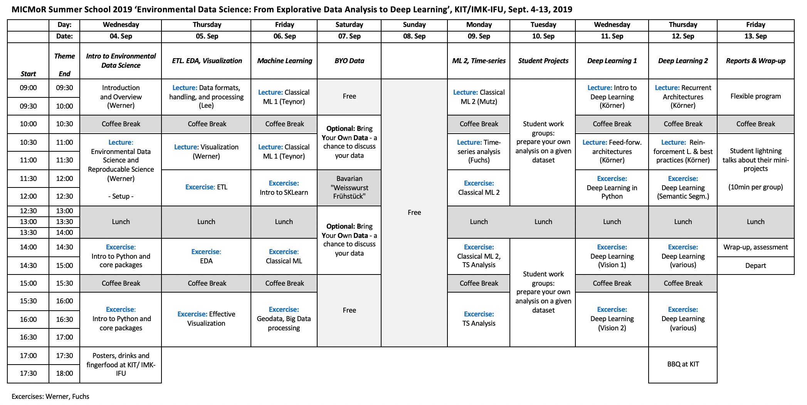

# KIT MICMoR SummerSchool 2019

Notebooks and info for the **[MICMoR](https://micmor.kit.edu) [SummerSchool "Environmental Data Science: From Data Exploration to Deep Learning"](https://micmor.kit.edu/sites/default/files/MICMoR%20Summer%20School%202019%20Flyer.pdf)**, IMK-IFU KIT Campus Alpin, Sept. 4 - 13 2019, Garmisch-Partenkirchen, Germany.  

This course covers the PyData stack and setting up a Data Science-centric development environment, good practices in reproducible science and the handling of common data formats. It then goes into Explorative Data Analysis techniques and effective visualisation, Machine Learning methods and finally applications of Deep Learning models for various Environmental Science tasks.   

## Timetable

## Notebooks

### Introductions

| Notebook         | Topic             | Description         |
|------------------|-------------------|---------------------|
| [01_intro_python](nbs/01_intro_python.ipynb)| Python basics | A general intro to Python concepts |
| [02_intro_numpy](nbs/intro_02_numpy.ipynb)| Numerical computation | A short introduction into key numerical python concepts |
| [03_intro_matplotlib](nbs/03_intro_matplotlib.ipynb)| Plotting | The basic plotting facility in Python |
| [04_intro_pandas](nbs/04_intro_pandas.ipynb)| Tabular data  | The library to handle tabular data in python |
| [05_intro_xarray](nbs/05_intro_xarray.ipynb)| Gridded data  | A great package to handle gridded data (based on numpy and pandas, uses netCDF as backend |

### Data formats, ETL and visualization

| Notebook         | Topic             | Description         |
|------------------|-------------------|---------------------|
| [10_processing_dataformats](nbs/10_processing_dataformats.ipynb)| Data formats | Overview of commen formats and how to read them |
| [11_processing_testingdata](nbs/11_processing_testingdata_raw.ipynb)| Data checking | A way to encode expectations of your data into code |
| [12_processing_eda-example1_forestcover_01](nbs/12_processing_eda-example1_forestcover_01.ipynb)| EDA | Example of an explorative data analysis |
| [13_processing_eda-example1_forestcover_02](nbs/13_processing_eda-example1_forestcover_02.ipynb)| EDA | Continued |
| [14_vis_plotting_packages_overview](nbs/14_vis_plotting_packages_overview.ipynb)| Visualization | An overview of python plotting packages |
| [15_vis_plotting_overview2_gridded](nbs/15_vis_plotting_overview2_gridded.ipynb)| Visualization | Visulization of gridded data |
| [16_vis_plotting_overview2_gridded](nbs/16_vis_holoviews_example1.ipynb | Visualization | Interactive visualizations and exploration |

### Classical Machine Learning / Special Topics

| Notebook         | Topic             | Description         |
|------------------|-------------------|---------------------|
| [20_ml_algos-iris](nbs/20_ml_algos-iris.ipynb)| Consolidate this | Consolidate this |
| [20_ml_algos-kmeans](nbs/20_ml_algos-kmeans.ipynb)| Consolidate this | Consolidate this |
| [20_ml_algos-logreg](nbs/20_ml_algos-logreg.ipynb)| Consolidate this | Consolidate this |
| [20_ml_algos-naivebayes](nbs/20_ml_algos-naivebayes.ipynb)| Consolidate this | Consolidate this |
| [21_ml_classifier_comparison](nbs/21_ml_classifier_comparison_MAKE_THIS_SKLEARN_INTRO.ipynb)| Consolidate this | Consolidate this |

** Special topics:**

| Notebook         | Topic             | Description         |
|------------------|-------------------|---------------------|
| [25_processing_dask_tutorial](nbs/25_processing_dask_tutorial_raw.ipynb)| Big Data | Demo of using dask for out-of-core computing |
| [26_vis_large-data_01](nbs/26_vis_large-data_01.ipynb)| Big Data Viz | Demo of using datashader to plot big data (1) |
| [27_vis_large-data_02](nbs/27_vis_large-data_02.ipynb)| Big Data Viz | Demo of using datashader to plot big data (2) |
| [28_processing_geodata](nbs/28_processing_geodata.ipynb)| Geodata | A quick overview of how to work with gridded and vector geodata |

### Classical Machine Learning 2 / Time-series analysis

| Notebook         | Topic             | Description         |
|------------------|-------------------|---------------------|
| [30_ml_dimensionality-reduction](nbs/30_ml_dimensionality-reduction.ipynb)| ML | PCA, LDA for dimensionality reduction |
| [31_ml_randomforest](nbs/31_ml_randomforest.ipynb)| ML | Random Forest classifiers and regression |
| [35_ts_maunaloa.ipynb](nbs/35_ts_maunaloa.ipynb)| Time-series | Working with time-series data |

### Deep Learning

| Notebook         | Topic             | Description         |
|------------------|-------------------|---------------------|
| [40_dl_intro_pytorch_fastai](nbs/40_dl_intro_pytorch_fastai.ipynb)| Deep Learning | Introduction to pytorch and fastai |
| [41_dl_plant-classifier](nbs/41_dl_plant-classifier.ipynb)| Data checking | A way to encode expectations of your data into code |
| [42_dl_rain-detection](nbs/42_dl_rain-detection.ipynb)| EDA | Example of an explorative data analysis |
| [43_dl_amazon-multiclass](nbs/43_dl_amazon-multiclass.ipynb)| EDA | Continued |
| [44_dl_tabular](nbs/44_dl_tabular.ipynb)| Visualization | An overview of python plotting packages |
| [45_dl_segmentation](nbs/45_dl_segmentation.ipynb)| Visualization | Visulization of gridded data |
| [46_dl_temporal-crop-classification](nbs/46_dl_temporal-crop-classification.ipynb)| Visualization | Visulization of gridded data |

## Datasets :: needs updating

This is a list of datasets we will work with in this course.

|Name|Source|Description|Use for|Comment|
|:--|:--|:--|:--|:--|
|tree occurrence|UCI|Predict tree occurrence based on |ML/ DL(tabular)|[source](https://archive.ics.uci.edu/ml/datasets/covertype)|
|amazon satellite classification|kaggle|Multi-objective classification|DL |[source](https://www.kaggle.com/c/planet-understanding-the-amazon-from-space) |  
|forest fire BA prediction |UCI | Regression on forest fire dataset | ML | [source](https://archive.ics.uci.edu/ml/datasets/Forest+Fires) |  
|plants|UCI|clustering ? | ML | [source](https://archive.ics.uci.edu/ml/datasets/Plants) | 
|water treatment plant| UCI | clustering ? | ML | [source](https://archive.ics.uci.edu/ml/datasets/Water+Treatment+Plant) |  
|GHG observing network| UCI | multi-variate time-series | TS | [source](https://archive.ics.uci.edu/ml/datasets/Greenhouse+Gas+Observing+Network) | 
|lightning strikes| NOAA | available via thredds server url | ? | [source](https://www.ncei.noaa.gov/thredds/catalog/lightning/catalog.html) |  
|detect rainfall events from CML|IFU|CNN|DL|[source](https://meetingorganizer.copernicus.org/EGU2019/EGU2019-13086.pdf)| 

